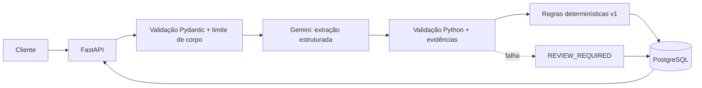

# Triagem Inteligente de Leads

Esta API recebe mensagens comerciais, extrai sinais semânticos com o Gemini e classifica os leads usando regras determinísticas em Python. A separação entre as duas etapas é simples:

> O Gemini interpreta. O Python valida e decide.

O MVP concentra-se nesse fluxo. Ele não inclui frontend, filas, Redis, microsserviços ou CRUD administrativo.

## Problema e escopo do MVP

Uma mensagem livre como:

```text
Olá, sou uma pessoa da Empresa Exemplo. Precisamos de 15 computadores ainda este mês e queremos um orçamento.
```

vira um registro estruturado e recebe uma classificação `QUENTE`, `MORNO` ou `FRIO`. Se a extração não for confiável, o serviço salva o lead como `REVIEW_REQUIRED` e interrompe a classificação.

O MVP oferece:

- validação de payload, e-mail, telefone, tamanho de mensagem e corpo HTTP;
- extração estruturada pelo Gemini com schema e evidências textuais;
- regras de score versionadas em Python (`v1`);
- persistência PostgreSQL via SQLAlchemy e migração Alembic;
- autenticação simples por `X-API-Key`;
- consultas de listagem e detalhe;
- erros genéricos, `request_id` e logs sem segredos;
- testes com fakes, sem chamadas reais ao Gemini.

## Arquitetura e fluxo



O conteúdo do lead segue para o modelo dentro de um objeto JSON e é tratado como dado não confiável. As instruções do sistema impedem que o modelo produza score, classificação, SQL, comandos ou ações. O Python valida o retorno antes de gravá-lo.

## Stack e estrutura

- Python 3.12+;
- FastAPI, Pydantic e `pydantic-settings`;
- SQLAlchemy 2 + `psycopg`;
- PostgreSQL;
- Alembic;
- SDK `google-genai`;
- pytest, httpx e Ruff.

```text
app/
  api/              autenticação, erros e limite de corpo
  integrations/     adaptador Gemini e validação de evidências
  persistence/      modelo SQLAlchemy, engine e repositório
  schemas/          contratos HTTP e enums
  services/         classificação e orquestração do lead
  config.py         configuração via ambiente/.env
  logging_config.py logs JSON com allowlist
  main.py           criação da aplicação e rotas
alembic/             migração PostgreSQL
tests/               testes unitários, integração em SQLite e segurança
```

## Regras de negócio

O score vai de 0 a 100. O serviço só soma pontos depois de validar os sinais extraídos:

| Sinal | Condição | Pontos |
| --- | --- | ---: |
| Intenção | `solicitar_orcamento` ou `comprar` | 35 |
| Intenção | `pesquisar` | 10 |
| Quantidade | 1 / 2–9 / 10+ | 5 / 15 / 25 |
| Urgência | `baixa` / `media` / `alta` | 5 / 15 / 25 |
| Empresa | presente | 5 |
| Contato | e-mail ou telefone válido no request | 10 |

- `score >= 70`: `QUENTE`;
- `40 <= score < 70`: `MORNO`;
- `score < 40`: `FRIO`.

O serviço persiste `versao_regras` para que alterações futuras possam ser auditadas. O Gemini não retorna nem controla o score ou a classificação.

## Modelo PostgreSQL

A tabela `leads` armazena o UUID, a mensagem original, os campos extraídos, o resultado da classificação, o status de processamento, o motivo de revisão, a versão das regras e os timestamps.

Constraints importantes:

- mensagem entre 1 e 5.000 caracteres;
- quantidade entre 1 e 1.000.000 quando presente;
- enums restritos para intenção, urgência, classificação e status;
- score entre 0 e 100;
- `PROCESSED` exige score/classificação e não aceita `review_reason`;
- `REVIEW_REQUIRED` exige `review_reason` e não aceita score/classificação.

O repositório usa SQLAlchemy com parâmetros. Nenhuma entrada do usuário é concatenada em uma consulta SQL.

## API REST

As rotas de negócio exigem o header `X-API-Key`. A comparação usa `secrets.compare_digest`, e a chave não aparece nos logs.

| Método | Rota | Uso |
| --- | --- | --- |
| `POST` | `/leads` | valida, extrai, classifica e persiste um lead |
| `GET` | `/leads?limit=20&offset=0&classificacao=QUENTE&status=PROCESSED` | lista leads; filtros são opcionais |
| `GET` | `/leads/{id}` | retorna um lead por UUID |

Exemplo de request:

```json
{
  "mensagem": "Precisamos de 15 computadores ainda este mês e queremos um orçamento.",
  "email": "contato@example.test",
  "telefone": "+55 (11) 99999-0000"
}
```

Exemplo resumido de resposta processada (dados fictícios):

```json
{
  "id": "00000000-0000-0000-0000-000000000001",
  "status_processamento": "PROCESSED",
  "nome": "Pessoa Exemplo",
  "empresa": "Empresa Exemplo",
  "produto_interesse": "computadores",
  "quantidade": 15,
  "intencao": "solicitar_orcamento",
  "urgencia": "alta",
  "score": 100,
  "classificacao": "QUENTE",
  "motivos": ["intent_high", "quantity_10_plus", "urgency_high", "contact_present"],
  "review_reason": null
}
```

Uma resposta processada traz `score`, `classificacao`, `motivos`, os campos extraídos e `status_processamento: "PROCESSED"`. A aplicação persiste `versao_regras` para auditoria. Em uma resposta de revisão, `score` e `classificacao` ficam nulos e `review_reason` informa um motivo seguro, como `gemini_timeout` ou `invalid_llm_output`.

Erros seguem o formato:

```json
{
  "error": {
    "code": "VALIDATION_ERROR",
    "message": "Invalid request",
    "request_id": "..."
  }
}
```

Códigos principais: `201` (criação), `200` (consulta), `401` (chave ausente ou incorreta), `404` (UUID inexistente), `413` (corpo acima do limite), `422` (payload inválido), `503` (banco indisponível) e `500` (erro interno genérico).

## Configuração local

Na raiz do projeto, execute os comandos a seguir no PowerShell.

1. Criar o ambiente e instalar dependências:

   ```powershell
   py -3.12 -m venv .venv
   .\.venv\Scripts\python.exe -m pip install -e ".[dev]"
   ```

   O comando cria um ambiente isolado e instala as dependências de runtime, testes e lint. O resultado esperado é `Successfully installed lead-triage`.
   Também é possível instalar as dependências pelo arquivo `requirements\requirements.txt`:

   ```powershell
   .\.venv\Scripts\python.exe -m pip install -r requirements\requirements.txt
   ```

2. Criar o arquivo local de configuração:

   ```powershell
   Copy-Item .env.example .env
   notepad .env
   ```

   Preencha `DATABASE_URL`, `GEMINI_API_KEY` e `APP_API_KEY` diretamente no `.env`. Mantenha esses valores fora do chat, do código e dos commits.

3. Variáveis disponíveis:

   | Variável | Tipo | Padrão |
   | --- | --- | --- |
   | `DATABASE_URL` | segredo | obrigatório |
   | `GEMINI_API_KEY` | segredo | obrigatório |
   | `APP_API_KEY` | segredo, mínimo 16 caracteres | obrigatório |
   | `GEMINI_MODEL` | configuração | `gemini-3.6-flash` |
   | `GEMINI_TIMEOUT_SECONDS` | configuração | `8` |
   | `GEMINI_MAX_ATTEMPTS` | configuração | `2` |
   | `MAX_MESSAGE_CHARS` | configuração | `5000` |
   | `MAX_BODY_BYTES` | configuração | `16384` |
   | `LOG_LEVEL` | configuração | `INFO` |

Para gerar a chave da aplicação sem expô-la, execute localmente:

```powershell
\.venv\Scripts\python.exe -c "import secrets; print(secrets.token_urlsafe(24))"
```

## PostgreSQL e menor privilégio

Conectado ao PostgreSQL como administrador, crie os papéis abaixo e substitua os marcadores localmente. Os marcadores não são credenciais reais.

```sql
CREATE ROLE lead_triage_migrator LOGIN PASSWORD '<SENHA_FORTE_DO_MIGRADOR>';
CREATE ROLE lead_triage_app LOGIN PASSWORD '<SENHA_FORTE_DA_APLICACAO>';
CREATE DATABASE lead_triage OWNER lead_triage_migrator;

\connect lead_triage
REVOKE CREATE ON SCHEMA public FROM PUBLIC;
GRANT USAGE ON SCHEMA public TO lead_triage_app;
```

Use o papel `lead_triage_migrator` somente para `alembic upgrade head`, pois ele pode criar e alterar tabelas. Depois da migração, conceda ao runtime apenas as operações necessárias ao MVP:

```sql
GRANT SELECT, INSERT ON TABLE leads TO lead_triage_app;
ALTER DEFAULT PRIVILEGES FOR ROLE lead_triage_migrator IN SCHEMA public
  GRANT SELECT, INSERT ON TABLES TO lead_triage_app;
```

O papel da aplicação não recebe `CREATE`, `DROP`, `ALTER` ou `DELETE`. Como o Alembic lê `DATABASE_URL`, use temporariamente a URL do migrador para aplicar a migração e depois restaure no `.env` a URL do papel `lead_triage_app`. Em produção, mantenha as credenciais de migração fora do processo da aplicação.

Aplicar a migração, na raiz do projeto:

```powershell
\.venv\Scripts\alembic.exe upgrade head
```

A revisão `0001_create_leads` deve ser aplicada sem erro. Se houver falha de autenticação ou conexão, confira a URL local e a disponibilidade do PostgreSQL. Não cole a URL no chat.

## Executar a API

Depois de preencher o `.env` e aplicar a migração, inicie a API:

```powershell
\.venv\Scripts\uvicorn.exe app.main:app --reload
```

O servidor ficará disponível em `http://127.0.0.1:8000`, e a documentação interativa do FastAPI ficará em `/docs`.

Exemplo PowerShell (substitua a chave apenas no seu terminal):

```powershell
$headers = @{ "X-API-Key" = "<SUA_CHAVE_LOCAL>" }
$body = @{
  mensagem = "Precisamos de 15 computadores ainda este mês e queremos um orçamento."
  email = "contato@example.test"
} | ConvertTo-Json

Invoke-RestMethod -Method Post -Uri http://127.0.0.1:8000/leads `
  -Headers $headers -ContentType "application/json" -Body $body
```

Para listar leads, use `Invoke-RestMethod -Method Get -Uri http://127.0.0.1:8000/leads -Headers $headers`. `401` indica header ausente ou incorreto; `413` indica corpo acima do limite; `503` indica banco indisponível ou falha não recuperável na persistência.

## Testes e qualidade

Na raiz do projeto, execute:

```powershell
\.venv\Scripts\python.exe -m pytest -q
\.venv\Scripts\ruff.exe check app tests alembic
\.venv\Scripts\ruff.exe format --check app tests alembic
```

Os testes usam SQLite em memória e fakes do Gemini. Por isso, não precisam de PostgreSQL, de uma `GEMINI_API_KEY` válida ou de chamadas externas. A validação registrada nesta etapa foi `73 passed`, Ruff sem erros e 31 arquivos formatados.

A suíte cobre:

- classes `QUENTE`, `MORNO`, `FRIO` e limites de score;
- schema, e-mail, telefone e corpo excessivo;
- sucesso, revisão, `401`, `404`, `413`, `422` e `503` da API;
- persistência, constraints e listagem;
- timeout, rate limit, indisponibilidade, autenticação e output inválido do Gemini;
- SQL injection, prompt injection e ausência de PII/secrets nos logs.

## Segurança, privacidade e limites

- A entrada do usuário é não confiável. Limites e schemas são aplicados antes do processamento.
- Prompt injection é mitigado pela separação entre instruções e dados, pelo schema fechado, pelas evidências e pelo isolamento das regras em Python. Filtros de palavras não são a defesa principal.
- O Gemini recebe somente a mensagem necessária para a extração. Chaves, URLs de banco, headers e configurações internas ficam fora do request.
- Os logs usam uma allowlist de campos operacionais. Mensagem completa, e-mail, telefone, tokens e connection strings não são registrados.
- Falhas externas viram mensagens genéricas, sem stack trace, SQL ou paths.
- O MVP ainda não tem autenticação de usuários, painel de revisão, atualização ou remoção de leads, rate limiting distribuído ou fila assíncrona. A chamada ao Gemini é síncrona e precisa ser revista se o volume crescer.
- A classificação é uma heurística v1. Qualquer alteração exige revisar os testes e incrementar `versao_regras`.

## Integração contínua

O workflow em `.github/workflows/ci.yml` instala `requirements/requirements.txt` e executa os testes, o Ruff e a verificação de formatação. Ele não precisa de PostgreSQL, Gemini ou secrets.
